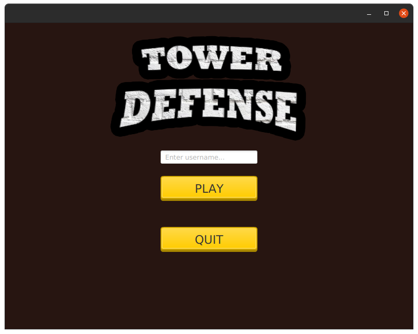
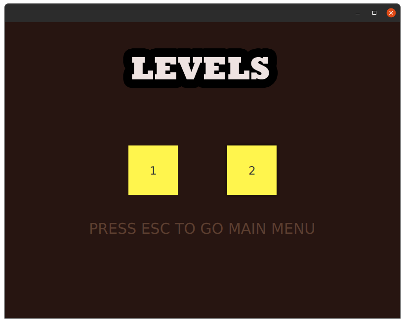
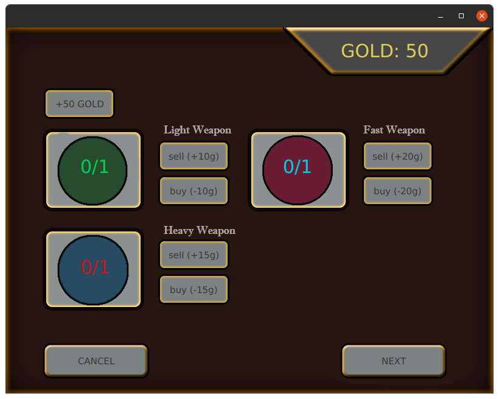
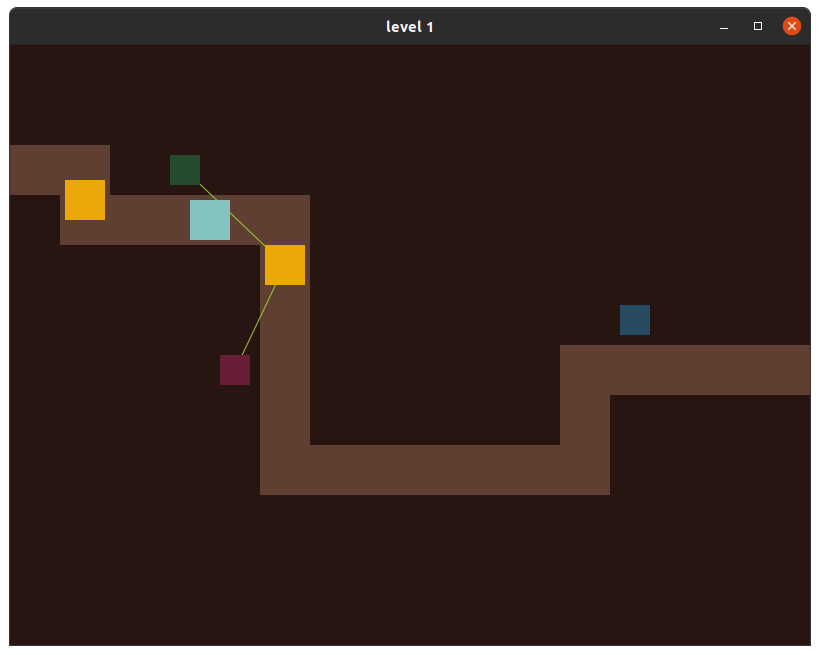
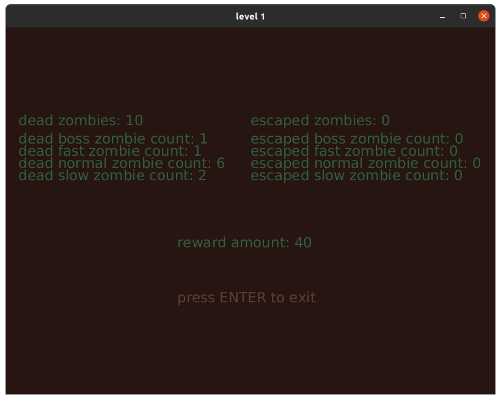

# tower_defense

A game project made for object oriented programming class.
written in Java with JavaFX

It was a very interesting project. I had wrote the game loop with JavaFx animation class.
It was a project made by me and my other 2 classmates. 

## How to build
What you need:
* javafx-sdk-11.0.2
* java version "1.8.0_251"
* Java(TM) SE Runtime Environment (build 1.8.0_251-b08)
* Java HotSpot(TM) 64-Bit Server VM (build 25.251-b08, mixed mode)
* javac 11.0.7
* adoptopenjdk-11-hotspot-amd64
* Visual Studio Code 

Just point the JavaFX SDK in the Visual Studio Code and run it. If you use an IDE then probably your IDE will detect JavaFX if installed or you can point the JavaFX SDK manually.

## Run From .jar File
You can run [this](tower_defense.jar) .jar file to play the game.

## Screenshots

* Main Menu

* Levels Menu

* First Level Shop

* First Level Game Screen

 * End of First Level Screen
 